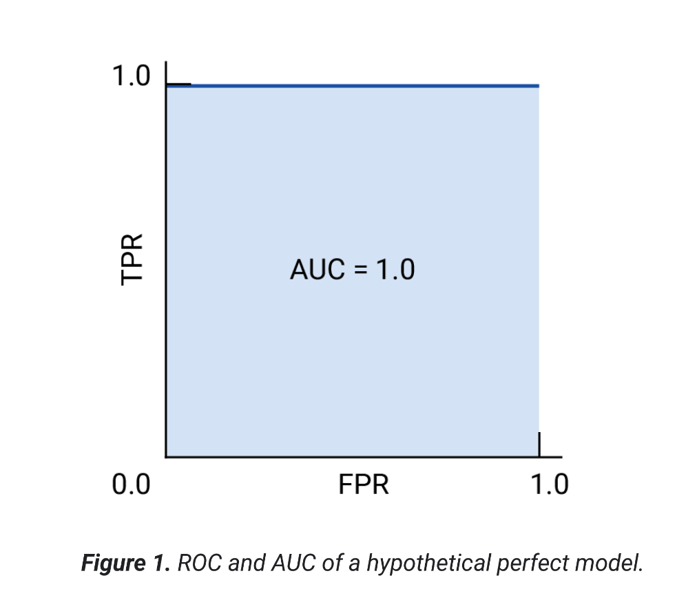
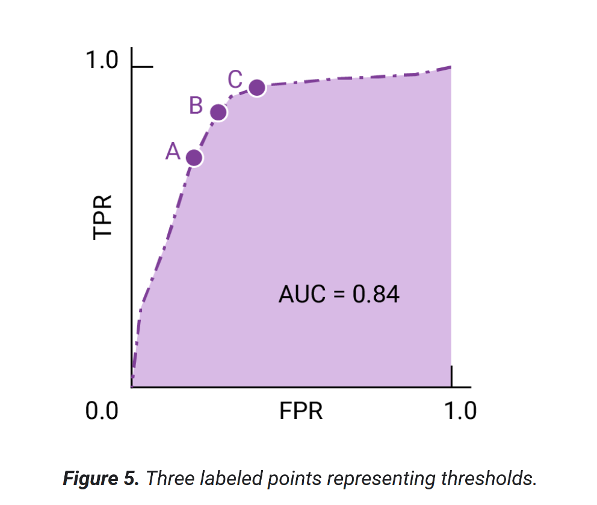

## Receiver-operating characteristic curve (ROC)

The ROC curve is a visual representation of model performance across all thresholds.
ROC is calculated by the true positive rate (TPR) and false positive rate (FPR) at every possible threshold

## Area under the curve (AUC)

The area under the ROC curve (AUC) represents the probability that the model, if given a randomly chosen positive and negative example, will rank the positive higher than the negative.

If false positives (false alarms) are highly costly, it may make sense to choose a threshold that gives a lower FPR, like the one at point A, even if TPR is reduced. Conversely, if false positives are cheap and false negatives (missed true positives) highly costly, the threshold for point C, which maximizes TPR, may be preferable. If the costs are roughly equivalent, point B may offer the best balance between TPR and FPR.

** AUC = 1.O - PERFECT **
** AUC > O.5 - FAIR **
** AUC = 0.5 - RANDOM GUESSING **
** AUC < 0.5 - WORSE THAN CHANCE **

If AUC < 0.5, it’s actually worse than random — the model is predicting in the wrong direction (it might be labeling positives as negatives and vice versa).If you flip your predictions (swap 0 ↔ 1), the AUC would become 1 - original AUC, turning a poor model (>0.5) into a good one.

## Prediction bias

Prediction bias means the model’s predictions are systematically wrong in one direction — it consistently overestimates or underestimates the target.

👉 Example:
If a model predicts student scores and always gives marks higher than actual, it has a positive bias.
If it always predicts lower, it has a negative bias.

📘 In short:

Bias = consistent error in predictions due to wrong assumptions or imbalance in data/training.

## Multi-class classification

Multi-class classification can be treated as an extension of binary classification to more than two classes. If each example can only be assigned to one class, then the classification problem can be handled as a binary classification problem, where one class contains one of the multiple classes, and the other class contains all the other classes put together. The process can then be repeated for each of the original classes.

If class membership isn't exclusive, which is to say, an example can be assigned to multiple classes, this is known as a multi-label classification problem.

---