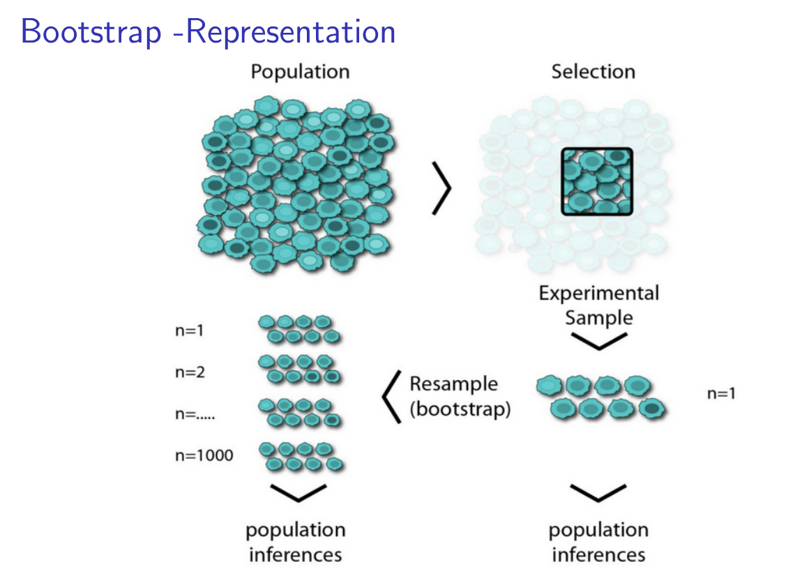

### Resampling

❑ Repeatedly draw sub-samples from the given data set
❑ Then use these splits to fit and assess the model

**Common methods**
Cross-validation:
❑ Improved approach for estimating the test error
❑ k-fold cross-validation
Bootstrapping:
❑ Quantify the uncertainty of an estimator or method
❑ Returns standard errors or confidence intervals for a coefficient

### Bootstrapping

Bootstrapping is a statistical resampling technique used to estimate how well your model performs.It works by randomly sampling (with replacement) from your dataset to create many new “bootstrap” datasets.

**How it works:** 
Suppose you have 100 data points.
You randomly pick 100 samples with replacement (so some samples may repeat, some may be left out).
Train your model on this new sample and test it on the remaining data.
Repeat this many times (say 1000 times).
Average all results → gives a more reliable estimate of model performance.

**Why we use it:**
To estimate accuracy, variance, or confidence intervals of a model.
When the dataset is small — it helps simulate many samples from limited data.

**Example:** 
Let’s say you train a decision tree 1000 times using bootstrapped samples.
You’ll get 1000 accuracy values → you can calculate the mean accuracy and standard deviation to know how stable your model is.

---

### What is Cross-Validation?

**Cross-validation (CV)** is a technique used to **test how well a model generalizes** — i.e., how it performs on unseen data.
It splits the dataset into multiple parts to make sure the model isn’t just memorizing one specific split.

> Cross-validation helps evaluate a model’s ability to generalize by training and testing it on multiple data splits, reducing overfitting and improving reliability of performance estimates.

**How it works (K-Fold Cross-Validation — the most common type):**
1. Divide the dataset into **K equal parts (folds)**.
2. Train the model on **K−1 folds** and test it on the **remaining 1 fold**.
3. Repeat this **K times**, each time changing which fold is used for testing.
4. Take the **average accuracy** (or other metric) across all K runs — that’s your final model performance.

**Example:** 
If K = 5
→ The dataset is split into 5 parts.
→ Model trains on 4 parts and tests on the 1 left out.
→ Repeat 5 times → 5 results → take their average.

**Why we use it:** 
* Gives a **better estimate of model performance** than a single train-test split.
* Reduces bias and variance in evaluation.
* Helps in **model selection** and **hyperparameter tuning**.

**Variations:**
| Type                         | Description                                               |
| ---------------------------- | --------------------------------------------------------- |
| **K-Fold CV**                | Dataset divided into K parts, each used once for testing. |
| **Stratified K-Fold CV**     | Keeps class ratio same in each fold (for classification). |
| **Leave-One-Out CV (LOOCV)** | Each sample is tested once (K = number of samples).       |
| **Repeated K-Fold CV**       | Repeats the process multiple times for more stability.    |

---