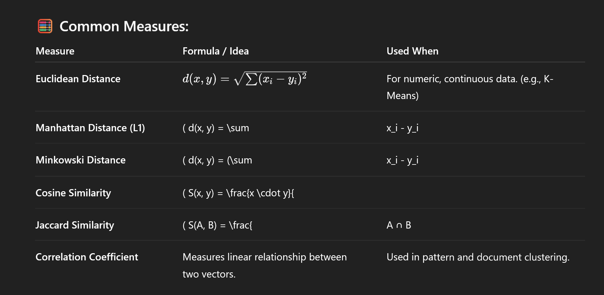

### Cluster Analysis

**Cluster: A collection of data objects**

    ◼ similar (or related) to one another within the same group
    ◼ dissimilar (or unrelated) to the objects in other groups

**Cluster analysis**

    ◼ Finding similarities between data according to the characteristics found in the data and grouping similar data objects into clusters.

    ◼ Clustering or cluster analysis is the task of grouping a set of objectsin such a way that objects in the same group (called a cluster) are more similar (in some sense) to each other than to those in other groups (clusters).

    